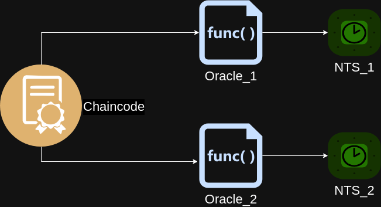
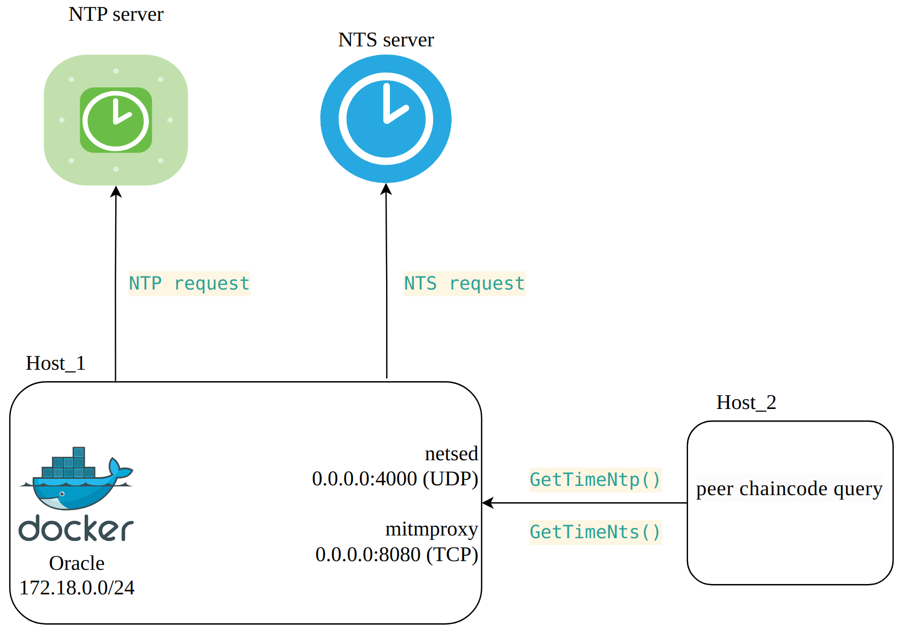
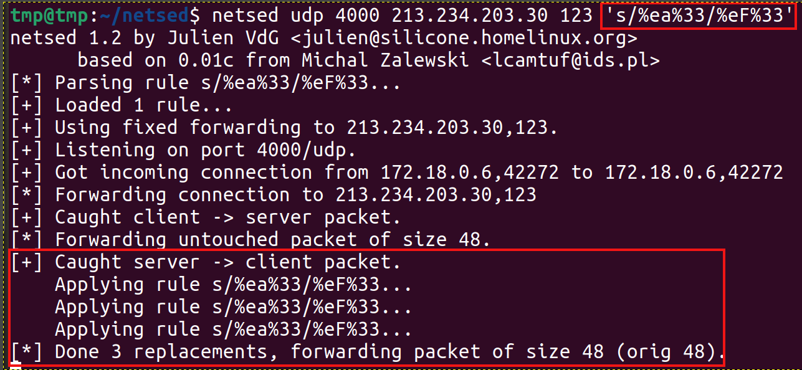
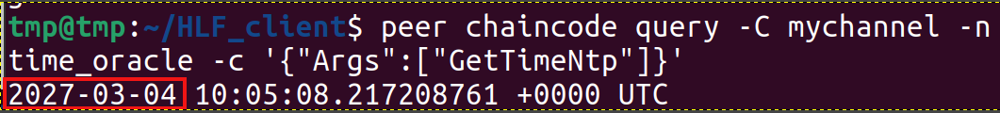
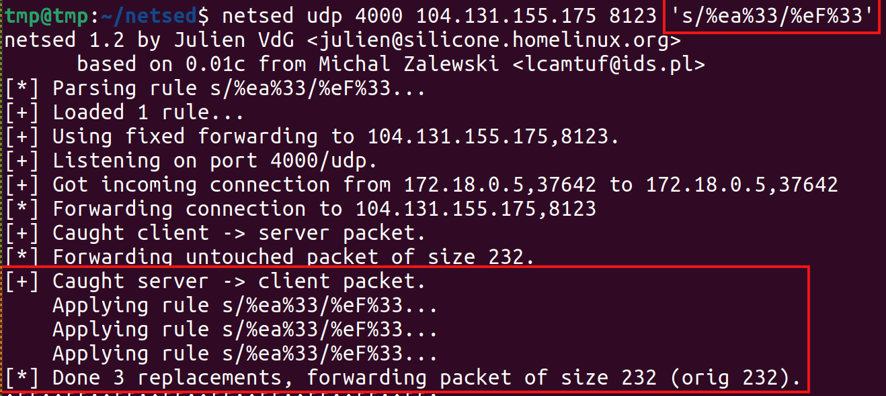
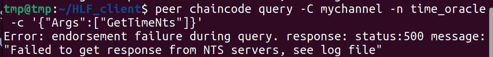
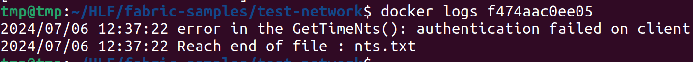
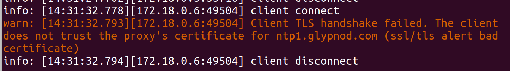
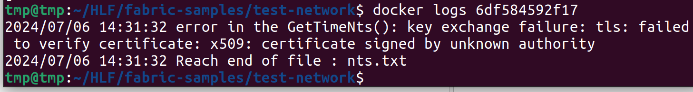

# hlf-time-oracle

`hlf-time-oracle` is a chaincode for blockchain Hyperledger Fabric provides accurate time to other chaincodes. `hlf-time-oracle` based on [ntp pakage](https://github.com/beevik/ntp) pakage and [nts pakage](https://github.com/beevik/nts). Thus solving the security problem associated with possible [transaction time manipulation](https://github.com/shanker-sec/HLF_TxTime_spoofing) by the blockchain client (CVE-2024-45244). The chaincode provides functions GetTimeNtp() and GetTimeNts(). Calling these functions creates a call to the NTP (Network Time Protocol) and NTS (Network Time Security) servers. The time received from any of these servers can be used to verify the correctness of the transaction time defined on the client side. Developers of chaincodes for blockchain can use `hlf-time-oracle` instead of independent writing code to interact with NTP and NTS servers. `hlf-time-oracle` does not save any data to the blockchain during its operation.
`hlf-time-oracle` for Hyperledger Fabric version 2.4.x in folder hlf_2.4. `hlf-time-oracle` for Hyperledger Fabric version 2.5.x in folder hlf_2.5.

[List of public servers](#1)
[Solving the problem of centralisation](#2)
[The features of the NTS protocol](#3)
[Resistance to the man-in-the-middle attack](#4)
[License](#License)

<a name="1"></a>
## List of public servers

[Public NTP servers](https://www.ntppool.org/ru/zone/@)
[Public NTS servers](https://gist.github.com/jauderho/2ad0d441760fc5ed69d8d4e2d6b35f8d)

<a name="2"></a>
## Solving the problem of centralisation

If you don't want to depend on a single time server, you can use multiple time oracles.

<p align="center">
  
  <br>
  Oracles
</p>

<a name="3"></a>
## The features of the NTS protocol

NTS is a enhancement of NTP (see [RFC 8915](https://www.rfc-editor.org/rfc/rfc8915)). There are 2 connections: TCP for TLS and UDP for NTP. The [port for NTP connection is determined by the NTS server](https://www.rfc-editor.org/rfc/rfc8915#section-4.1.8). It can be different from the standard 123/UDP. Keep this in mind when configuring the firewall.

For correct TLS connection establishment it is required that the client (i.e. the system on which `hlf-time-oracle` is running) has relatively correct system time (falling within the NTS-server certificate validity period). Otherwise [the connection will not be established](https://www.sectigo.com/resource-library/tls-ssl-handshake-errors-how-to-fix-them#What%20is%20a%20TLS%20handshake%20failure?).

<a name="4"></a>
## Resistance to the man-in-the-middle attack

It is recommended to use GetTimeNts() instead of GetTimeNtp(). Unlike NTP, the use of NTS is resistant to the man-in-the-middle attack. In case of unauthorized spoofing of the open data part, the following error is logged: `authentication failed on client`. In case of an attempt to spoof the NTS server certificate, the following error is logged: `key exchange failure: tls: failed to verify certificate: x509: certificate signed by unknown authority`.


### Experiment

<p align="center">
  
  <br>
  Model
</p>

`hlf-time-oracle` is running in the docker (docker network 172.18.0.0/24). On the docker host (Host_1) [netsed](https://www.kali.org/tools/netsed/) (port 4000/UDP) and [mitmproxy](https://www.kali.org/tools/mitmproxy/) (port 8080/TCP) are running .Traffic to them from `hlf-time-oracle` will get through iptables. The second host (Host_2) accesses Oracle's GetTimeNtp() and GetTimeNts() functions (via [peer chaincode query](https://hyperledger-fabric.readthedocs.io/en/release-2.5/commands/peerchaincode.html#peer-chaincode-query) call). Calling these functions causes Oracle to call the NTP server and the NTS server, respectively.

#### NTP

An iptables rule to redirect traffic to netsed:
```sh
iptables -t nat -A PREROUTING -s 172.18.0.0/24 -d 213.234.203.30/32 -p udp -m udp --dport 123 -m udp -j REDIRECT --to-ports 4000
```
Run netsed with rule.
<p align="center">
  
  <br>
  Create a rule in netsed to replace %ea%33 with %eF%33
</p>


<p align="center">
  
  <br>
  The result of a successful attack.
</p>

#### NTS

##### netsed

An iptables rule to redirect traffic to netsed (NTS server ntp1.glypnod.com has an IP address 104.131.155.175):
```sh
iptables -t nat -A PREROUTING -s 172.18.0.0/24 -d 104.131.155.175/32 -p udp -m udp --dport 8123 -m udp -j REDIRECT --to-ports 4000
```

Run netsed with rule.
<p align="center">
  
  <br>
  Create a rule in netsed to replace %ea%33 with %eF%33
</p>


<p align="center">
  
  <br>
  The result of a unsuccessful attack.
</p>

Let's see docker logs:
<p align="center">
  
  <br>
  docker logs
</p>

##### mitmproxy

An iptables rule to redirect traffic to mitmproxy (NTS server ntp1.glypnod.com has an IP address 104.131.155.175):

```sh
iptables -t nat -A PREROUTING -p tcp -s 172.18.0.0/24 --dport 4460 -m tcp -d 104.131.155.175 -j REDIRECT --to 8080
```

Let's see mitmproxy logs:
<p align="center">
  
  <br>
  mitmproxy logs
</p>


Let's see docker logs:
<p align="center">
  
  <br>
  docker logs
</p>

<a name="License"></a>

## License
MIT
